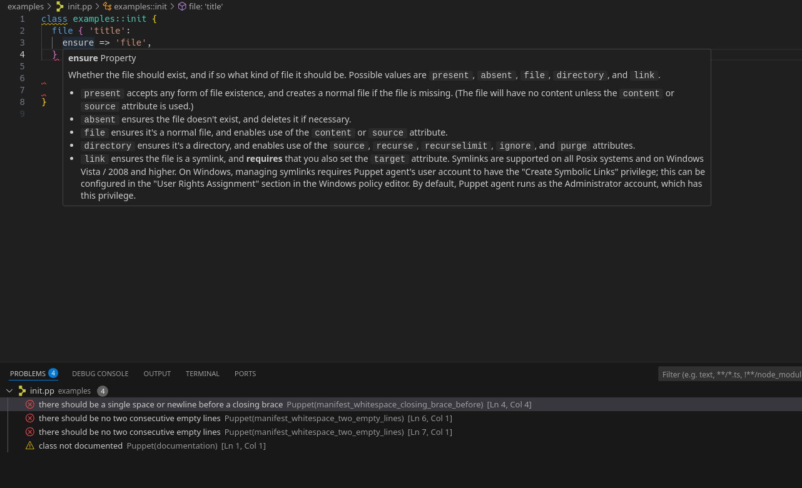

# Using Puppet VSCode plugin on NixOS

## The problem to solve

The full functionality of the Puppet VSCode plugin requires a proper installation
of the PDK or the puppet agent. Unforuntaly the way how NixOS installs the PDK or
the puppet agent is not compatilbe with the VSCode plugin.

## Using devenv to emulate an puppet agent installation

Using [devenv](https://devenv.sh) we can create an environment suiteable for the plugin
to regognize it aa puppet installation.

Caveats:

- You need to specify an absolute path for the puppet agent installation in the vscode settings.
- We need to pin ruby json library because the language server is not compatible with recent versions.

## vsocde settings

```json
{
    "puppet.installType": "agent",
    "puppet.installDirectory": "/full/path/to/repo/.devenv/state/.bundle/ruby/3.2.0",
    // only required for debugging
    //"puppet.editorService.loglevel": "debug",
    //"puppet.editorService.debugFilePath": "puppet-debug.log"
}
```

When opening the [example file](example/init.pp), you should something similar like this.
(Notice the tooltip when you hover over a property, e.g. ensure).



Happy Coding!

## Recommandations

This repository provides a full setup for running puppet bolt. Some dependencies might not be strictly
required just for using the VSCode plugin. It's recommended to install `direnv` for automatic activiation
of the devenv.

Install the [devenv vscode plugin](https://marketplace.visualstudio.com/items?itemName=mkhl.direnv) and the [Nix IDE vscode plugin](https://marketplace.visualstudio.com/items?itemName=jnoortheen.nix-ide).

## Usage

```shell
# clone this repo
git clone git@github.com:roock/nixos-vscode-puppet.git
cd nixos-vscode-puppet
# allow direnv in this directory
direnv allow .
# setup vscode settingsd
echo "{
    "puppet.installType": "agent",
    "puppet.installDirectory": "$PWD/.devenv/state/.bundle/ruby/3.2.0",
}" | tee .vscode/settings.json
code .
```

## Open Issues

- This has been tested with the `vscode-fhs` NixOS package. Testing with the `vscode`, `vscodium` or `vscodium-fhs` is still outstanding.
